# Pokelike Userscripts

A collection of userscripts for improving the experience on [pokelike.xyz](https://pokelike.xyz). These scripts are intended to run with **Tampermonkey** in the browser.

## Requirements

Before using any script in this repository, make sure the following requirements are met:

- A Chromium-based browser such as **Google Chrome**, **Brave**, **Microsoft Edge**, or another browser that supports Tampermonkey.
- The **Tampermonkey** browser extension installed and enabled.
- Access to the supported website, currently **https://pokelike.xyz/**.
- Permission to run custom userscripts in the browser through Tampermonkey.

## Prerequisites

Before installing a script from this repository:

1. Install **Tampermonkey** from the browser extension store.
2. Open the Tampermonkey dashboard and make sure the extension is active in the browser.
3. Download or copy the userscript file you want to use from this repository.
4. Verify that the script's `@match` metadata includes `https://pokelike.xyz/*`, so it runs only on the intended site.

## Installation

Follow these steps to install and run a script from this repository:

1. Install and enable Tampermonkey in the browser.
2. You can click on the link in the Scripts section to install it directly and skip to step 8, or continue from step 3.
3. Open the Tampermonkey dashboard.
4. Click **Create a new script**.
5. Delete the default template code.
6. Paste the content of the selected `.js` file from this repository.
7. Save the script.
8. Open or reload [pokelike.xyz](https://pokelike.xyz/).
9. Tampermonkey will inject the script automatically when the page URL matches the script metadata.

## Updating a Script

The script should update automatically through Tampermonkey, or Tampermonkey should prompt you when an update is available.

If that does not happen, or if you installed the script manually without the auto-update metadata, follow these steps:

1. Reinstall the script using the direct `.user.js` install link, confirm the overwrite when prompted, and then skip to step 6. Alternatively, continue with step 2.
2. Open Tampermonkey.
3. Open the installed script.
4. Replace its content with the latest version from this repository.
5. Save the script.
6. Reload the page.

## Troubleshooting

If a script does not run correctly, check the following:

- Tampermonkey is enabled in the browser.
- The script is enabled in the Tampermonkey dashboard.
- The script `@match` metadata points to `https://pokelike.xyz/*`.
- The page has been fully reloaded after saving the script.
- The target DOM elements used by the script still exist, since site updates can break selectors.

## Scripts

### Pokelike Weakness Panel
**File:** `pokelike-weakness-panel.user.js`

Adds a weakness and resistance panel to the existing Pokelike interface on `pokelike.xyz`.

Current behavior:

- Extends the existing `team-hover-card` popup with a type effectiveness panel.
- Shows all **non-neutral** matchups, meaning weaknesses, resistances, and immunities different from `1x`.
- Adds a fixed inline panel in trade rows next to the trade member info, so matchup data is always visible without hover.
- Includes anti-refresh logic to avoid unnecessary DOM rebuilds when the interface updates.
- Preserves the native popup visibility behavior controlled by the page JavaScript.
- Can work alongside the Fairy fix script.
- When a matchup would normally be 0×, the panel shows Struggle and 50PWR instead.
#### Install directly

Click the link below to install the script in Tampermonkey:

If Tampermonkey does not open the install page automatically, open the script URL manually from the browser or use **Tampermonkey → Dashboard → Utilities → Import from URL** and paste the same link.

#### Previews

<table>
  <tr>
    <td align="center">
      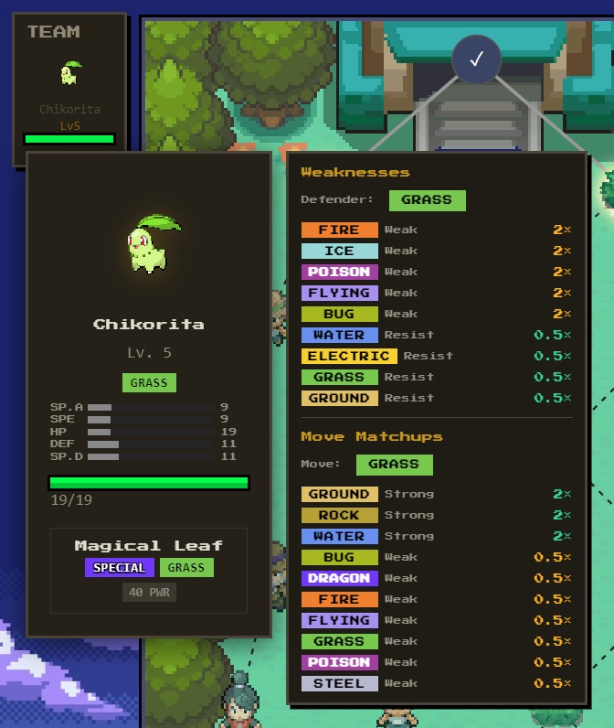 
      <em>Weaknesses and move matchups in the team hover card.</em>
    </td>
    <td align="center">
      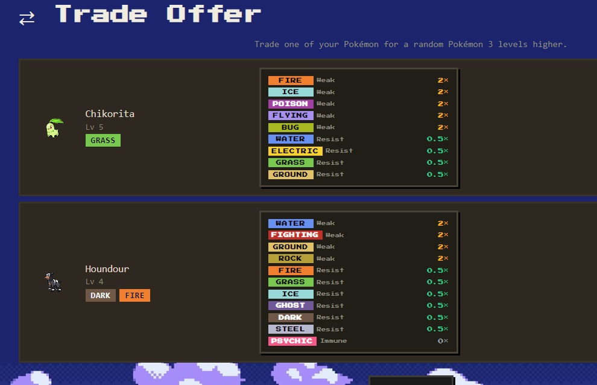 
      <em>Weakness info shown in trade offers.</em>
    </td>
  </tr>
  <tr>
    <td align="center">
      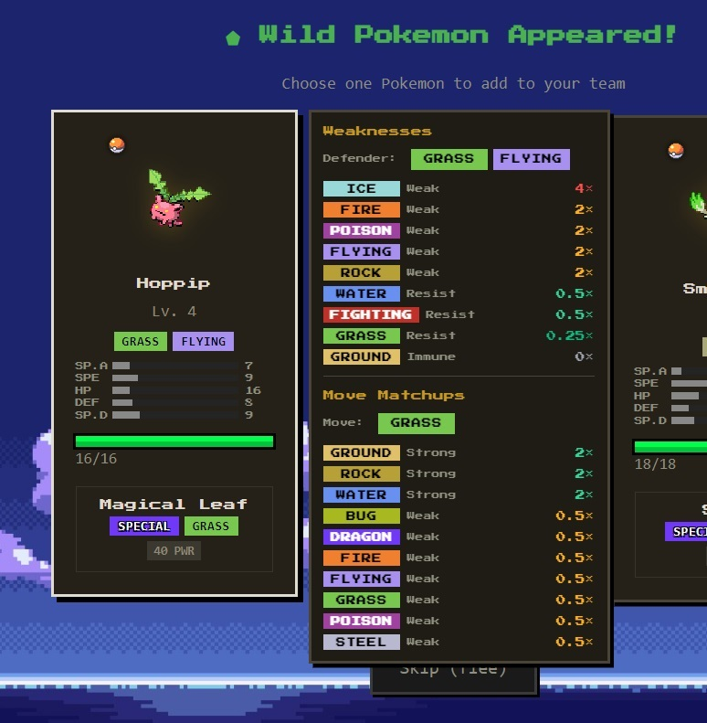 
      <em>Panel added to catch choices.</em>
    </td>
    <td align="center">
      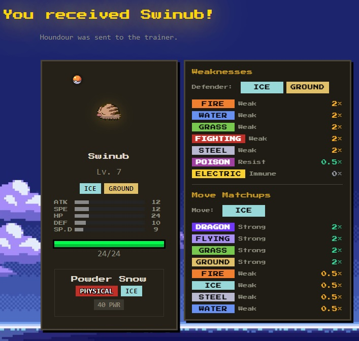 
      <em>Matchup info on reward cards.</em>
    </td>
  </tr>
  <tr>
    <td align="center">
      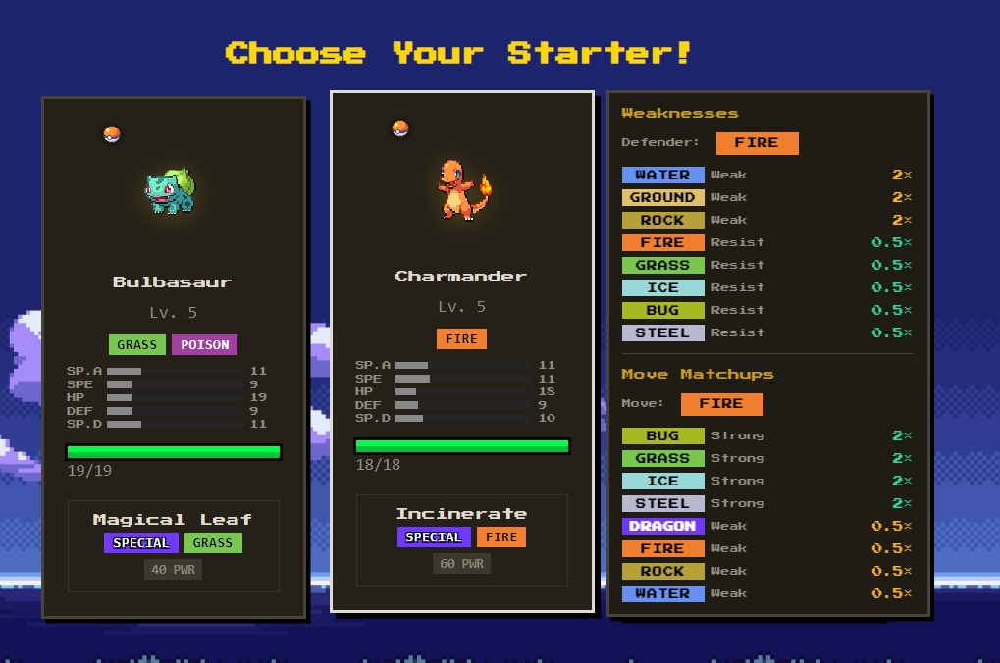 
      <em>Better starter comparison before picking.</em>
    </td>
    <td align="center">
      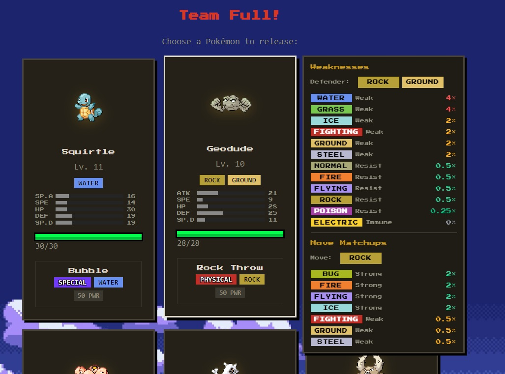 
      <em>Faster swap decisions with visible weaknesses.</em>
    </td>
  </tr>
  <tr>
    <td align="center">
      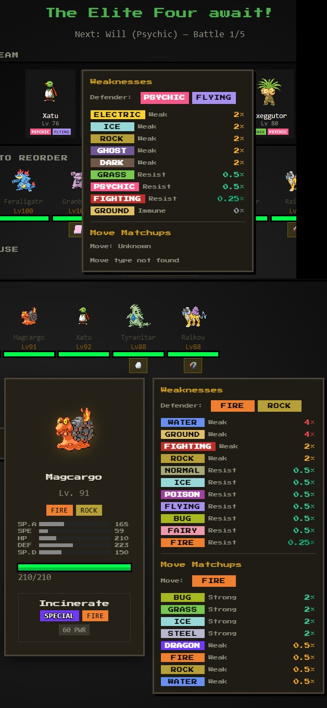 
      <em>Extra matchup help during Elite Four prep.</em>
    </td>
    <td align="center">
      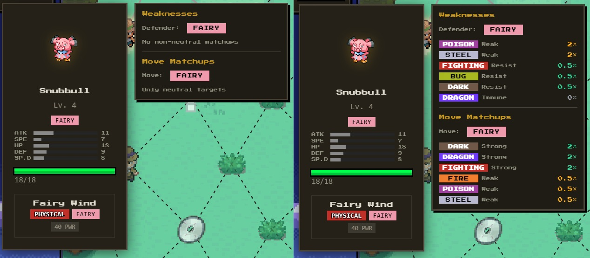 
      <em>Correct Fairy-type matchup support.</em>
    </td>
  </tr>
  <tr>
    <td align="center">
      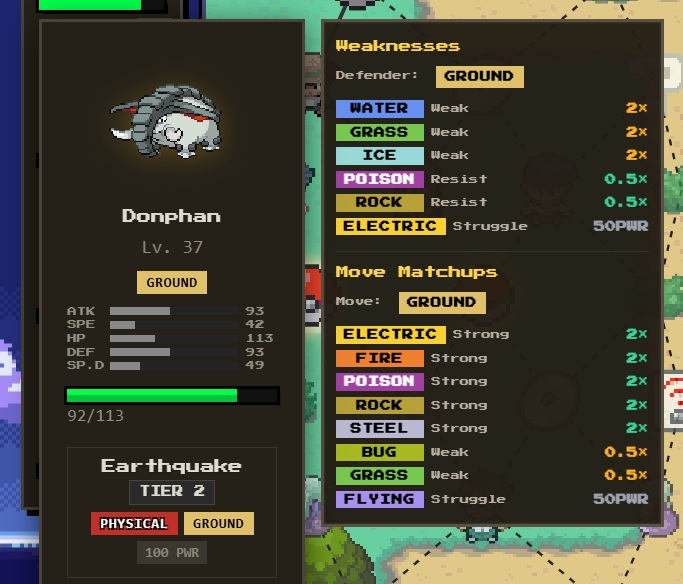 
      <em>When a matchup would normally be 0×, the panel shows Struggle and 50PWR instead.</em>
    </td>
  </tr>
</table>

### Pokelike Fairy Fix
**File:** `pokelike-fairy-fix.user.js`

Adds the missing Fairy type interactions to Pokelike when the site's internal type chart does not support Fairy correctly.

What it does:
- Patches the live `TYPE_CHART` used by the page.
- Adds the missing Fairy attack and defense matchups.
- Runs only when Fairy support is missing or incomplete.
- Does nothing if Pokelike already includes the correct Fairy data.

Why this exists:
- Fairy should be super effective against Dragon, Dark, and Fighting.
- Fairy should resist Bug, Dark, and Fighting, and be immune to Dragon.
- Fairy should be weak to Poison and Steel.
- If the site treats Fairy as neutral `1x` in every matchup, this script fixes that behavior.

#### Install directly

Notes:
- This script is designed to be safe to keep installed.
- If the site developers fix Fairy support in the future, the script will detect that and skip patching.
- This script is intended to complement `pokelike-weakness-panel.user.js`, but it can also be used on its own.

### Pokelike Evolution Level Info
**File:** `pokelike-evolution-level-info.user.js`

Adds the evolution level at the bottom of the Pokelike hover popup on `pokelike.xyz`.

Current behavior:

- Appends info to the existing `team-hover-card` popup.
- Shows the pokemon's next evolution level, if it evolves.

#### Install directly

If Tampermonkey does not open the install page automatically, open the script URL manually from the browser or use **Tampermonkey → Dashboard → Utilities → Import from URL** and paste the same link.

#### Previews

  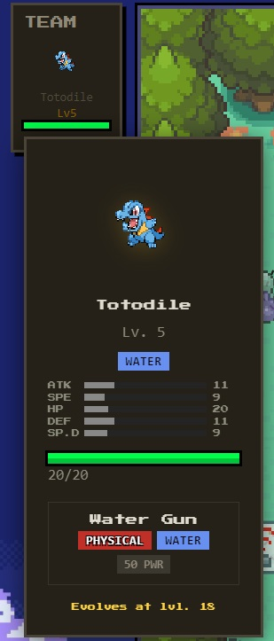 
  <em>Displays the evolution level on the Pokémon card.</em>

### Pokelike Move Tier Info
**File:** `pokelike-move-tier-info.user.js`

Adds the move's tier within the pokemon's move box in the Pokelike hover popup on `pokelike.xyz`.

Current behavior:

- Adds info to the existing `poke-move` div.
- Shows the current move's tier.

#### Install directly

If Tampermonkey does not open the install page automatically, open the script URL manually from the browser or use **Tampermonkey → Dashboard → Utilities → Import from URL** and paste the same link.

#### Previews

<table>
  <tr>
    <td align="center">
      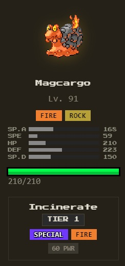 
      <em>Tier 1 — Basic move tier shown in the hover panel.</em>
    </td>
    <td align="center">
      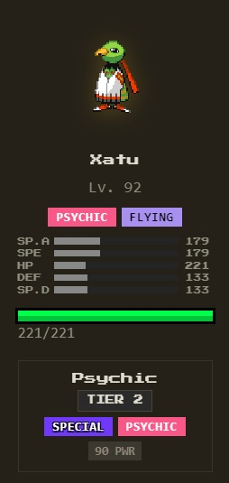 
      <em>Tier 2 — Upgraded move tier with stronger move selection.</em>
    </td>
    <td align="center">
      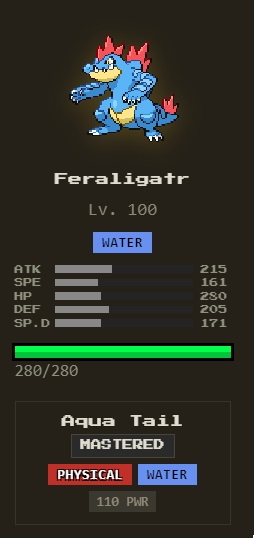 
      <em>Mastered — Final mastered state displayed in the hover panel.</em>
    </td>
  </tr>
</table>

### Pokelike Team Slot Edit Nickname Button
**File:** `pokelike-pokemon-nickname-edit.user.js`

Adds a small **✎** button to each Pokémon slot in your team bar on `pokelike.xyz` to edit nickname.

What it does:

- Shows a small edit button directly on each team slot.
- Lets you quickly change a Pokémon's nickname without touching the main game code.
- Opens a simple rename window when the button is clicked.
- Works with the existing drag-and-drop team bar without interfering with item clicks.
- Updates the team bar immediately after saving the new nickname.

#### Install directly

If Tampermonkey does not open the install page automatically, open the script URL manually from the browser or use **Tampermonkey → Dashboard → Utilities → Import from URL** and paste the same link.

#### Previews

#### Previews

<table>
  <tr>
    <td align="center">
      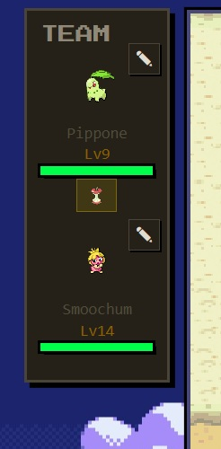 
      <em>Adds a small pencil button to each team slot for quick nickname editing.</em>
    </td>
    <td align="center">
      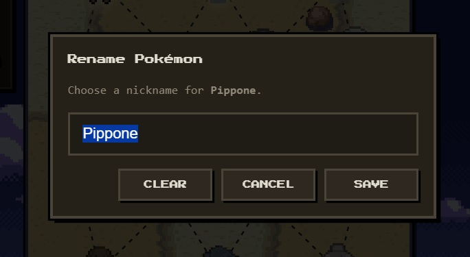 
      <em>Opens a simple rename window to change the Pokémon nickname.</em>
    </td>
  </tr>
</table>

## Notes

These scripts are unofficial browser-side enhancements. They only modify the page locally in the current browser session and do not change the website for other users.
